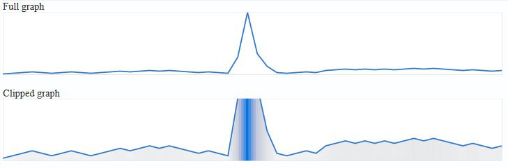
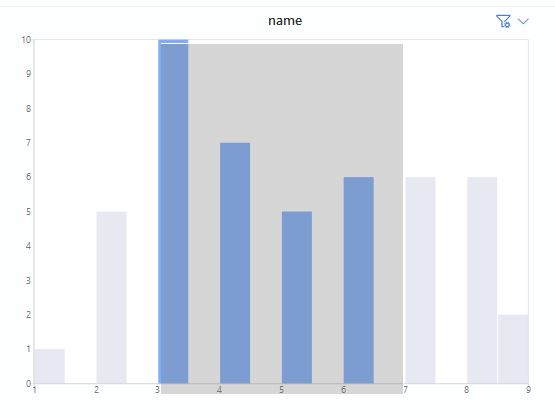
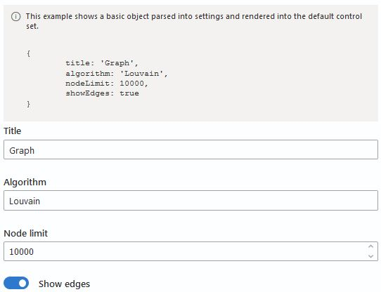
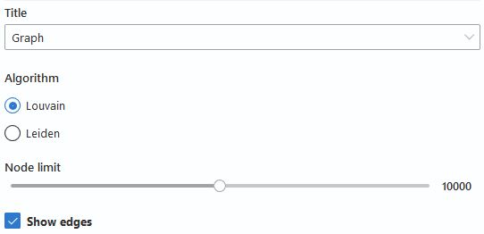
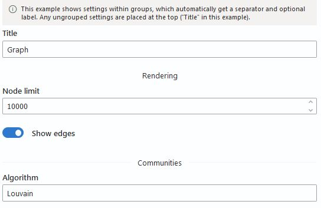
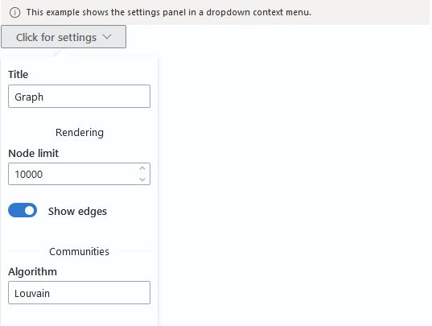
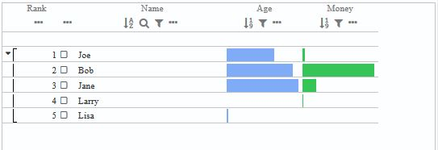

# @essex-js-toolkit/themed-components-stories

Provides a set of useful UI components with built-in Thematic theming.
This is a visual testing playground for some themed components in the /themed-components package.

## Running the StoryBook

- Run yarn build from the project root.
- Run yarn start (or npm start) from @essex/themed-components-stories to start StoryBook

<br /> _If you are having issues, try editing into the .webpack.config.js to alias react_

## Component Stories

### [ClippedGraph](/packages/themed-components-stories/stories/ClippedGraph.stories.tsx)

ClippedGraph is a component that creates a line chart that handles extreme distributions with a few clipping/wrapping strategies.
The "clipped graph" concept was presented by Haihan Lin at VIS2019. https://vdl.sci.utah.edu/publications/2019_infovis_clipped_graphs/
This chart can also produce a horizon plot, or be formatted to look like a sparkline.

```jsx
<ClippedGraph
	width={800}
	height={100}
	data={[1, 5, 2, 3, 1]}
	clipped={true}
	gradient={true}
/>
```

<b>Output:</b>
<br />


### [ControlledHistogramFilter](/packages/themed-components-stories/stories/ControlledHistogramFilter.stories.tsx)

ControlledHistogramFilter is a styled D3.js SVG histogram that performs brushing and filtering.
Data provided does not need to be ordered.
selectedRange is the area to be selected.
SelectedFill will change the appearance of the histogram bars on when in selected range.
unSelectedFill will be the color of the histogram bars if not in selected range.
onChange will be invoked if selectedRange is changed due to brushing.

```jsx
interface ControlledHistogramFilterProps {
	name: string;
	data: number[];
	width: number;
	height: number;
	selectedRange: [number | undefined, number | undefined];
	onChange?: (range: [number | undefined, number | undefined]) => any;
	selectedFill?: string;
	unselectedFill?: string;
}
```

<b>Example:</b>

```jsx
<ControlledHistogramFilter
	name={'histogram name'}
	data={[1, 5, 2, 3, 1]}
	width={600}
	height={400}
	selectedRange={[undefined, undefined]}
/>
```

<b>Output:</b>
<br />


### [Settings](/packages/themed-components-stories/stories/Settings.stories.tsx)

Story of an auto-generated settings panel that parses a supplied object and generates a list of Fluent UI controls based on the data types.
A configuration object can be supplied that maps specific object fields to more detailed control configuration, such as changing between a Toggle or Checkbox.
In addition, an onChange handler will invoke for any setting, supplying the changed setting's key and new value.
Note that this could be used in an entirely declarative/serializable manner if desired.

<b>Example:</b>

```jsx
const settings = {
  title: 'Graph',
  algorithm: 'Louvain',
  nodeLimit: 10000,
  showEdges: true
}
<Settings
  settings={settings}
  config={
    {
    title: {
      control: 'dropdown',
      params: { options: ['None', 'Graph', 'Nodes', 'Edges'] },
    },
    algorithm: {
      control: 'radio',
      params: { options: ['Louvain', 'Leiden'] },
    },
    nodeLimit: {
      control: 'slider',
      params: {
        max: 20000,
        step: 1000,
      },
    },
    showEdges: {
      control: 'checkbox',
    },
    } as any
  }
  onChange={()=>{}}
/>

```

<b>Basic Settings Output:</b>
<br />


<hr />

<b>Advanced Settings Output:</b>
<br />


<hr />

<b>Grouped Settings Output:</b>
<br />


<hr />

<b>ContextMenu Settings Output:</b>
<br />


### [ThematicLineup](/packages/themed-components-stories/stories/ThematicLineup.stories.tsx)

This component uses the standard [LineUp.js](https://lineup.js.org/) table, and does (a) injection of Thematic, (b) cleans it up a little bit, and (c) adds a custom filtering mechanism.
ThematicLineupStory displays a LineUp instance, while also applying default thematic styles and data colors.
Use it for a React-style JSX wrapper around LineUp that has more potential flexibility than the very configuration-limited version exposed by the LineUp project.
This allows arbitrary column configurations via jsx, and a set of global filters if desired.

<b>Output:</b>
<br />



### License

Licensed under the [MIT License](../../LICENSE).
