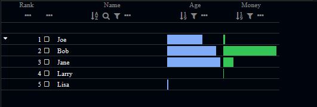

# @essex-js-toolkit/thematic-lineup

### [ThematicLineup](/packages/themed-components-stories/stories/ThematicLineup.stories.tsx)

This component uses the standard [LineUp.js](https://lineup.js.org/) table, and does:

- injection of Thematic
- cleans it up a little bit
- adds a custom filtering mechanism

ThematicLineupStory displays a LineUp instance, while also applying default thematic styles and data colors.
Use it for a React-style JSX wrapper around LineUp that has more potential flexibility than the very configuration limited version exposed by the LineUp project.
This allows arbitrary column configurations via jsx, and a set of global filters if desired.
 
<b>Light Theme</b>

 

<b>Dark Theme</b>

 

### License

Licensed under the [MIT License](../../LICENSE).
