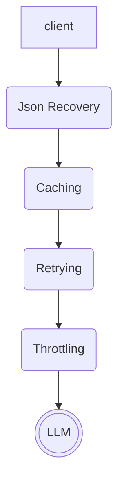
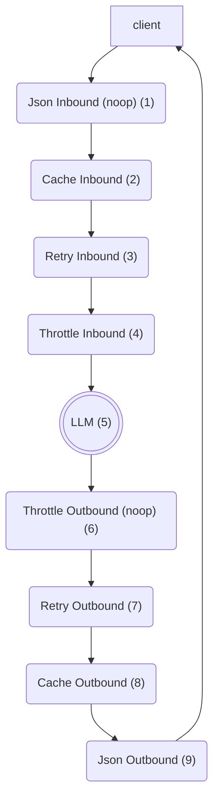

# fnllm

A generic LLM wrapper that provides a function protocol for LLM implementations. An OpenAI wrapper is provided.

# Getting Started

```sh
pip install fnllm
```

# Overview

`fnllm` is an LLM wrapper that provides function-based protocols for accessing LLM functionality (e.g. `fnllm.types.ChatLLM`, `fnllm.types.EmbeddingsLLM`). It's designed to be provider-agnostic, but it currently uses OpenAI as the default provider. 

## Chain of Responsibility
A key feature of `fnllm` is that it hides several key concerns behind a _chain of responsibility_ abstraction in order to ensure fast and durable data-processing jobs. These concerns include _retrying_, _throttling_, _caching_ and _json recovery_. 

The _chain of responsibility_ uses Python decorators to decorate the raw LLM invocation. At a high level, the decorator stack looks like this:


## Request Lifecycle
To understand the lifecycle of an `fnllm` request in more detail, we'll break this down into the _inbound_ and _outbound_ sides of a request.

As a client fires off a request, the request makes it way through the decorator stack. Each decorator is responsible for a specific concern, and they all work together to ensure that the request is processed correctly. 

### Initial Entry
The first decorator a request encounters is the _Json Recovery_ decorator (1), which has no inbound behavior. The first _active_ decorator is the _Cache_ decorator (2), which will check if the request is already cached. If it is, the cached response will be returned immediately, bypassing the rest of the decorator stack. It is important that the _Cache_ decorator is the first active inbound decorator, as this ensures we have speedy cache reads when performing fully-cached data runs.

### Live Request Execution
If a request has not been handled by the Cache decorator, it will process as a live request. There are a couple of key concerns we need to address: we need to ensure that we don't exceed the rate limits of the LLM provider, and we need to ensure that we can handle any errors that occur during the request. We want our retry logic to adhere to our model's rate-limit capacity, so the rate limiting is applied closest to the LLM. The _Retry_ decorator (3) wraps the rest of the chain with a Retry strategy (e.g. exponential backoff, linear incremental, randomized). Finally, closest to the LLM, the request is handled by the _Throttle_ decorator (4), which will ensure that the request is sent at a rate that is acceptable to the LLM provider. Finally, the request will be sent to the LLM (5).

## Live Response Handling
Once we receive an LLM response, it will be returned through the stack in reverse order. The _Throttle_ decorator (6) has no outbound behavior, as it only applies to inbound requests. In case of errors, the _Retry_ decorator (7) will attempt to re-drive the request according to the retry policy. Upon a successful request, the _Cache_ decorator (8) will write the response into the cache. 

## Final Orchestration & Redriving
Finally, the _Json Recovery_ decorator (9) will attempt to parse the LLM response as JSON and interpret it as the given Pydantic model (if provided). If the response is malformed, or if it does not adhere to the Pydantic model, we will attempt a recovery. Depending on the Json Receiver strategy, it will either attempt to clean up the malformed JSON text or re-drive the LLM call.