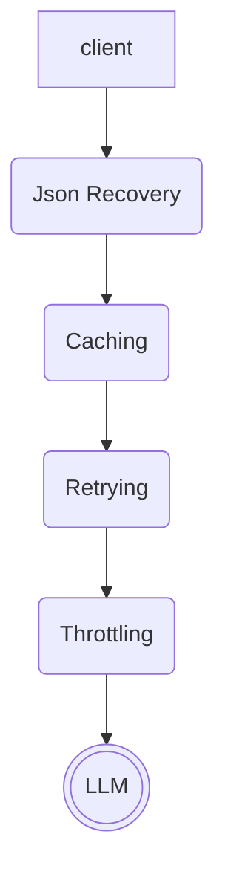
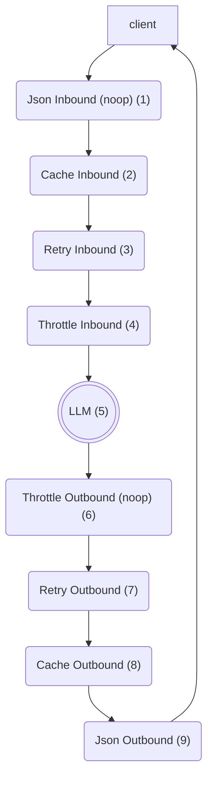

# fnllm

A generic LLM wrapper that provides a function protocol for LLM implementations. An OpenAI wrapper is provided.

# Getting Started

```sh
pip install fnllm
```

# Overview

`fnllm` is an LLM wrapper that provides function-based protocols for accessing LLM functionality (e.g. `fnllm.types.ChatLLM`, `fnllm.types.EmbeddingsLLM`). It's designed to be provider-agnostic, but it currently uses OpenAI as the default provider. 

## Chain of Responsibility
A key feature of `fnllm` is that it hides several key concerns behind a _chain of responsibility_ abstraction in order to ensure fast and durable data-processing jobs. These concerns include _retrying_, _throttling_, _caching_ and _json recovery_. 

The _chain of responsibility_ uses Python decorators to decorate the raw LLM invocation. At a high level, the decorator stack looks like this:


## Request Lifecycle
To understand the lifecycle of an `fnllm` request in more detail, we'll break this down into the _inbound_ and _outbound_ sides of a request.

As a client fires off a request, the request makes it way through the decorator stack. Each decorator is responsible for a specific concern, and they all work together to ensure that the request is processed correctly. The first decorator a request encounters is the _Json Recovery_ decorator (1), which has no inbound behavior. The next point is the _Cache_ decorator (2), which will check if the request is already cached. If it is, the cached response will be returned immediately, bypassing the rest of the decorator stack. If not, the request will continue to the _Retry_ decorator (3), which will wrap the rest of the chain with a Retry strategy (e.g. exponential backoff, linear incremental, randomized). The request will then be passed to the _Throttle_ decorator (4), which will ensure that the request is sent at a rate that is acceptable to the LLM provider. Finally, the request will be sent to the LLM (5), and the response will be returned through the stack in reverse order. The _Throttle_ decorator (6) has no outbound behavior, as it only applies to inbound requests. The _Retry_ decorator (7) will handle any errors that occur during the request, and the _Cache_ decorator (8) will write cache the response. Finally, the _Json Recovery_ decorator (9) will attempt to parse the LLM response as JSON and interpret it as the given Pydantic model (if provided). If the response is malformed, depending on the Json Receiver strategy, it will either attempt to clean up the malformed JSON text or redrive the LLM call.