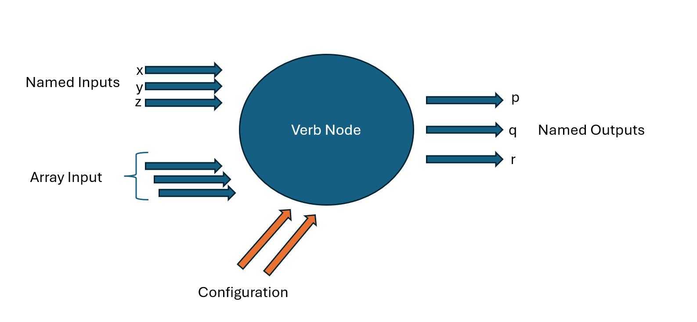

# Reactive-Dataflow
Reactive Processing Graphs for Python.


# Getting Started

## Installation 
```sh
pip install reactivedataflow
```

The key dependencies for this project include `rx`, `networkx`, and `pydantic`. These are outlined in the `pyproject.toml` dependencies section.

# Key Concepts
`reactivedataflow` has a design that is inspired by our prior work with [datashaper](https://github.com/microsoft/datashaper) and the neuron model of neural networks.
In a neural network, individual neurons are connected to other neurons through synapses. 
In traditional neural network topologies, there are "hidden" layers of normal neurons, in addition to special neurons that are designated as input neurons, and other neurons that are designated as output neurons.

In `reactivedataflow`, we have a similar conceptual framework of _Verb Nodes_, _Input Nodes_, and _Output Nodes_.

## Nodes
Nodes are the heart of the system, and they are responsible for processing data streams and emitting transformed results. A key feature of this system is that data streams between nodes are _polymorphic_ - meaning that they can be any type. Care should be taken that the processing function of a verb node is able to handle the data types that are passed to it.

### Input Nodes
Input nodes are simple nodes that are initialized with a `reactivex` event stream, and emit data on a single output port.

### Output Nodes
Output nodes are simple nodes that are used to observe the output of a verb node. They are initialized with a reference to a verb node, and emit data on a single output port. 
This is the primary mechanism for reading results from the processing graph.

### Verb Nodes



Verb nodes are composed of a number of "ports" that are used to describe their inputs, outputs, and configuration properties. 
* _Input ports_ represent data streams that are consumed by the verb node. Each message from an input port will result in a re-evaluation of the VerbNode's processing function, and may result in new messages being emitted on any number of output ports. 
* The _array input port_ is a special port type that allows for multiple input streams to be consumed by the verb node. This is useful for cases where multiple data streams are required to be processed together. When any of the input streams emit a message, the verb node will re-evaluate its processing function with the latest messages from all input streams.
* _Configuration_ ports are used to provide static configuration values, such as system services or algorithmic hyper-parameters, to the verb node. These values are used to parameterize the processing function, and are not expected to change during the lifetime of the verb node.
* _Output ports_ represent data streams that are emitted by the verb node. Each message emitted on an output port will be sent to any downstream nodes that are connected to the verb node via an input port.

## Edges
Edges are used to connect nodes together in a processing graph. They are used to define the flow of data between nodes, and are used to establish the dependencies between nodes. Each edge represents an event-based reactive datastream. Edges are attached to _two_ nodes. Edges must be configured with:

* The _from node_ that is the source of the data stream.
* The _to node_ that is the destination of the data stream.

Optionally, they may include:
* The _to_port_, which is the name of the input port in the target node. If this is not provided it will be treated as an array input.
* The _from_port_, which is the name of the output port in the source node. If this is not provided it, we will use the _default output name_.

# Usage

The first task in using `reactivedataflow` is to define your relevant processing verbs.  
Processing verbs are _pure functions_ that are annotated using the `@verb` decorator and the `Annotated` feature. 
A key feature of `reactivedataflow` is that verb functions _are not explicitly coupled_ to reactivedataflow, and may be used in other contexts as well.

```python
from reactivedataflow import verb, Input, Config

@verb(name="print")
def print_verb(
	val: Annotated[str, Input()], 
	prefix: Annotated[str, Config()] = ""
) -> str:
	return f"{prefix}{val}"
```

Once we have a set of verbs defined, we can define a processing graph to establish a dataflow. 
In this example, we'll load a simple one-node graph using the `Graph` schema. 
The `GraphBuilder` also has a builder-mode API so that graphs can be defined iteratively.

```python
import reactivex as rx
from reactivedataflow import (
	GraphBuilder,
	Graph,
	InputNode,
	Node,
	Edge,
	Output
)

#
# Define a simple graph
#
graph = GraphBuilder().load_model(
		Graph(
				inputs=[InputNode(id="input")],
				nodes=[Node(id="printed", verb="print", config={"prefix": "!"})],
				edges=[Edge(from_node="input", to_node="printed")],
				outputs=[Output(name="result", node="printed")],
		)
).build(
		inputs={
				"input": rx.of(["hello", "world"]),
		}
)
graph.output("result").subscribe(print)
# Output: 
# !hello
# !world
```
